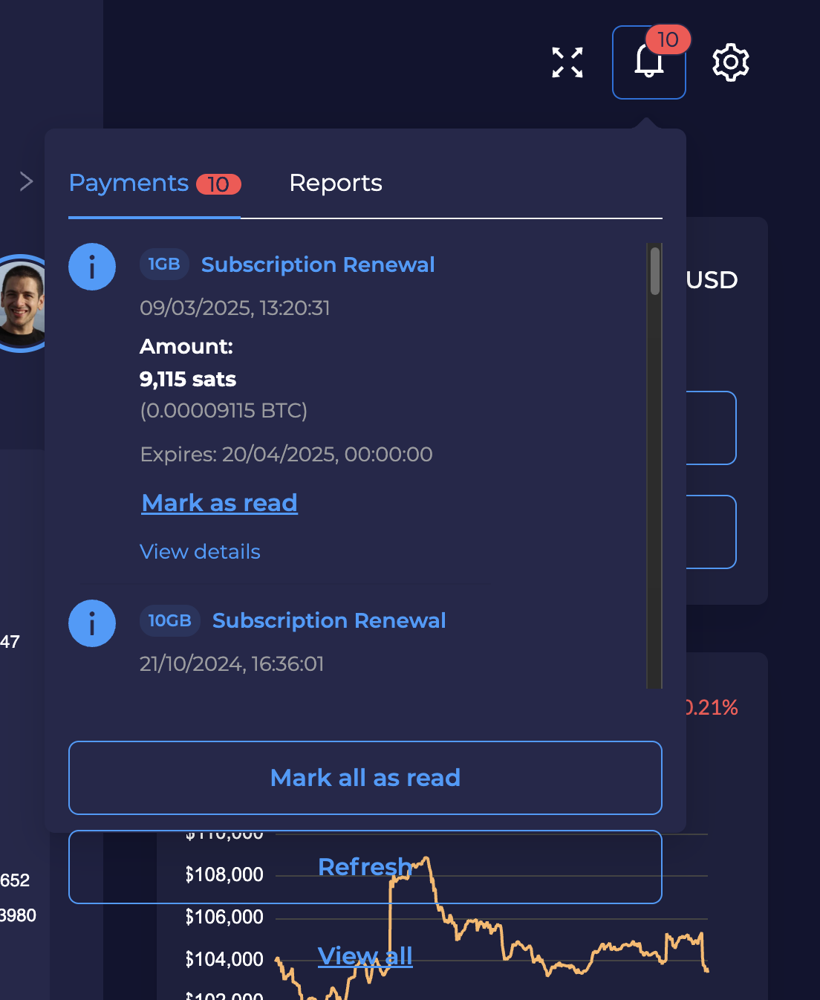
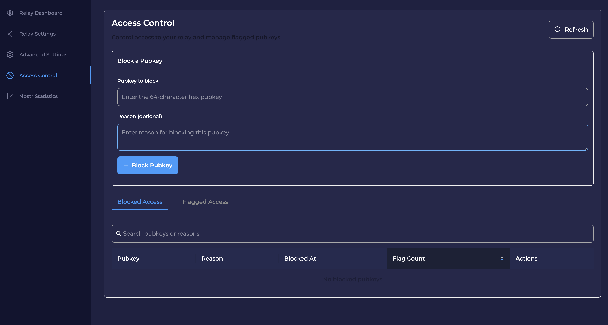
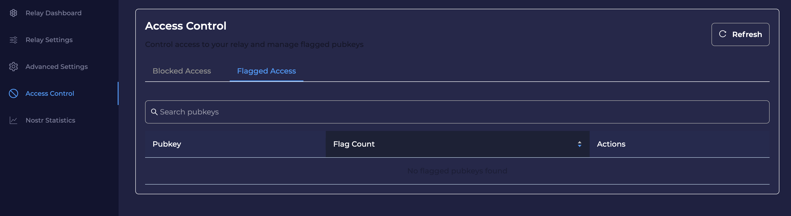
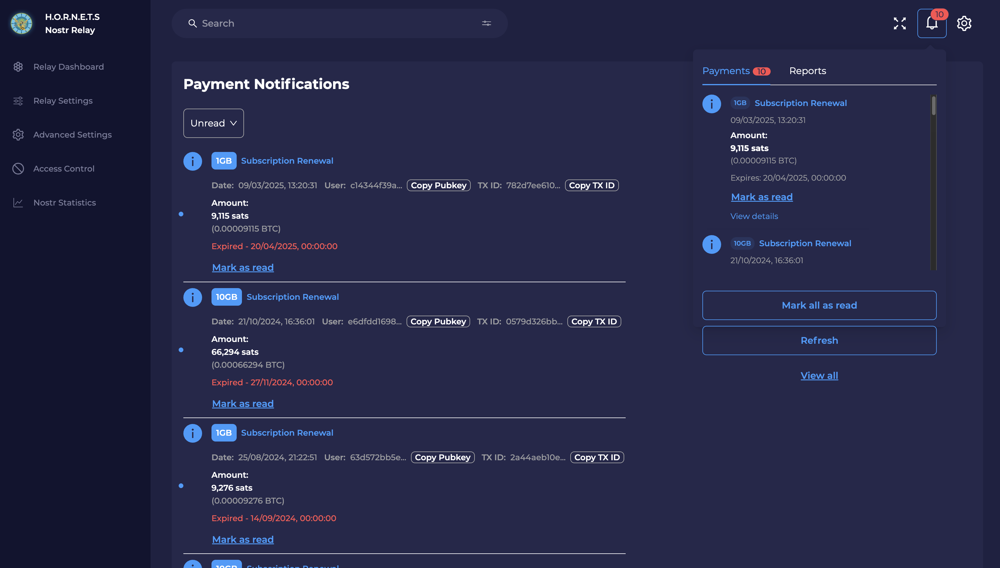

# Frontend UI/UX Issues

## Issue #1: Notification Panel Button Layout

**Problem:** The "Refresh" and "View all" buttons are overlapping or visually disconnected from the notifications content area (10 notifications shown).

**Screenshot:**

**Expected Fix:** 
- Properly align buttons with adequate spacing
- Ensure buttons are visually connected to the notification content
- Maintain responsive design

**Component Location:** `src/components/profile/profileFormNav/nav/notifications/Notifications/Notifications.tsx`

---

## Issue #2: Access Control Text Readability & Visual Design

**Problem:** The Access Control page has poor text contrast and readability issues. Some text elements are difficult to read due to low contrast against the dark background, affecting user experience and accessibility.

**Screenshot:**

**Expected Fix:**
- Improve text contrast ratios to meet accessibility standards
- Enhance readability of form labels, placeholder text, and table headers
- Adjust color scheme for better visual hierarchy
- Ensure all text elements are clearly visible against the dark theme

**Component Location:**
- `src/components/blocked-pubkeys/BlockedPubkeys.tsx`
- `src/components/blocked-pubkeys/components/BlockedPubkeysTable.tsx`
- `src/components/blocked-pubkeys/BlockedPubkeys.styles.ts`

---

## Issue #3: Flagged Access Tab Text Readability

**Problem:** The Flagged Access tab view has the same text readability issues as the Blocked Access tab. Poor contrast makes it difficult to read table content, search placeholder text, and other UI elements against the dark background.

**Screenshot:**

**Expected Fix:**
- Improve text contrast ratios for table headers and content
- Enhance readability of search input placeholder text
- Ensure "No flagged pubkeys found" message is clearly visible
- Apply consistent color scheme improvements across both tabs

**Component Location:**
- `src/components/blocked-pubkeys/BlockedPubkeys.tsx`
- `src/components/blocked-pubkeys/components/FlaggedPubkeysTable.tsx`
- `src/components/blocked-pubkeys/BlockedPubkeys.styles.ts`

---

## Issue #4: Notification Dropdown Auto-Close Behavior

**Problem:** When clicking "View all" in the notifications dropdown, the dropdown doesn't automatically close. Users expect the dropdown to close when navigating to the full notifications page, but it remains open creating a poor UX.

**Screenshot:**

**Expected Fix:**
- Automatically close notification dropdown when "View all" is clicked
- Ensure smooth transition to notifications page
- Maintain consistent dropdown behavior across all navigation actions

**Component Location:**
- Notification dropdown component (likely in header/layout area)
- "View all" button handler needs to trigger dropdown close

---

## Issue #5: Payment Notifications Pagination Stuck on Page 2

**Problem:** When viewing payment notifications on the payments page, the pagination gets stuck on page 2. Users can navigate to page 2, but attempting to move forward or backward from page 2 doesn't work - the pagination controls become unresponsive.

**Screen Recording:**

**Steps to Reproduce:**
1. Click "View all" in the payment notifications dropdown
2. Navigate to the payments page
3. Go to page 2 using pagination controls
4. Try to navigate to any other page (forward/backward)
5. Pagination controls become unresponsive

**Expected Fix:**
- Fix pagination logic to allow proper navigation between all pages
- Ensure pagination state is properly managed and updated
- Verify API calls are made correctly for each page request
- Test pagination functionality across all available pages

**Component Location:**
- Payment notifications page component
- Pagination component used for payment notifications
- Related API calls in `src/api/paymentNotifications.api.ts`
- Pagination logic in `src/hooks/usePaymentNotifications.ts`

---

## Note

Hey, just play around with the panel a bit - I may have missed some other issues that need fixing.
